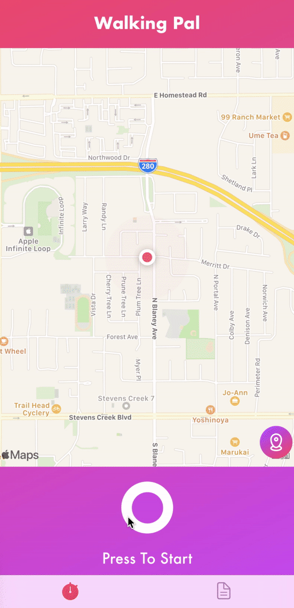

# WalkingPal

WalkingPal is your activity tracker when you need to track your walking, jogging or runnig activity with easy and sample interface.

It track your location and calculate your avg. speed and the distance of your activity.

# Functionality 

WalkingPal will show user current location on map and by pressing start button WalkingPal will start to track user locations

When user doing an activity there is two option to choose:

1:Pasue activity by pressing the pause button and continue activity by pressing it again.
2:Stop activity by swipe the left botton to the right, it will finish the tracking activity.

Perfectly balanced

By ending the activity WalkingPal will show user the tracked path which passed.

And by tapping the Activity Log button in tab bar user can check all of activities.

# Contact me

for any support or feedback you can reach me by : mike.dev.acc@gmail.com

Thank you so much!

